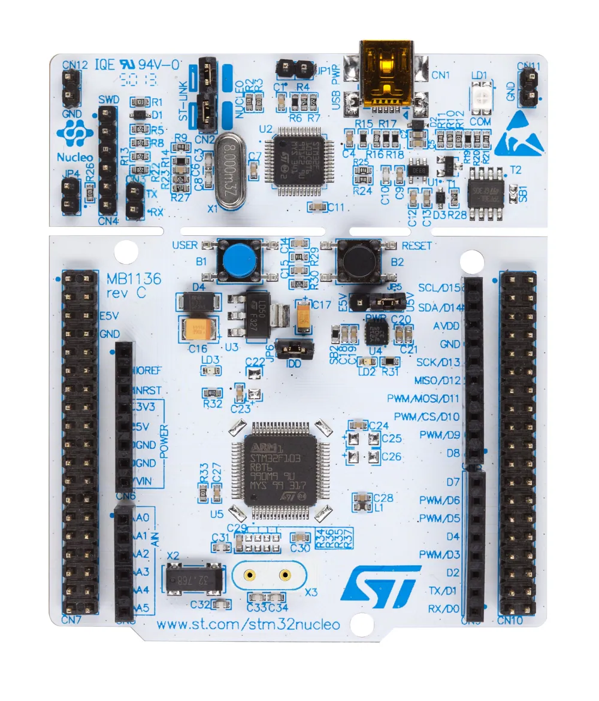

# F103_Blink

Projeto de blink de LED com STM32F103 utilizando STM32CubeIDE e a biblioteca HAL.

## Hardware
- Placa: NUCLEO-F103RB

- IDE: STM32CubeIDE

## Descrição
Pisca o LED do pino PA5 a cada 500ms.

## Como compilar

1. Clone o repositório:
    https://github.com/MathesuMBS22/F103_Blink.git

2. Abra o STM32CubeIDE
3. Vá em **File → Open Projects from File System**
4. Selecione a pasta do projeto clonado
5. Clique em **Build** (martelo) para compilar
6. Conecte a placa Nucleo-F103RB via USB e clique em **Run** para gravar